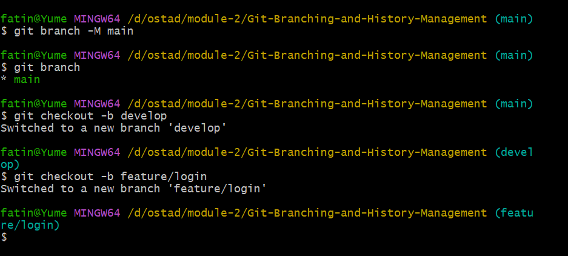
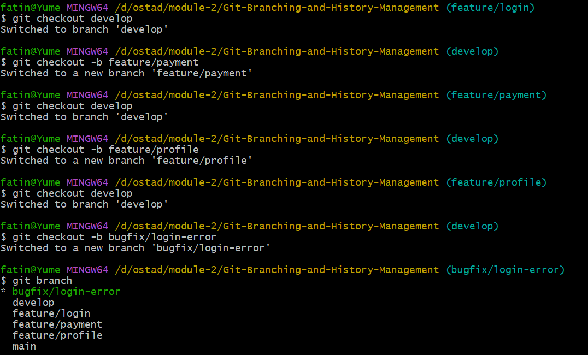
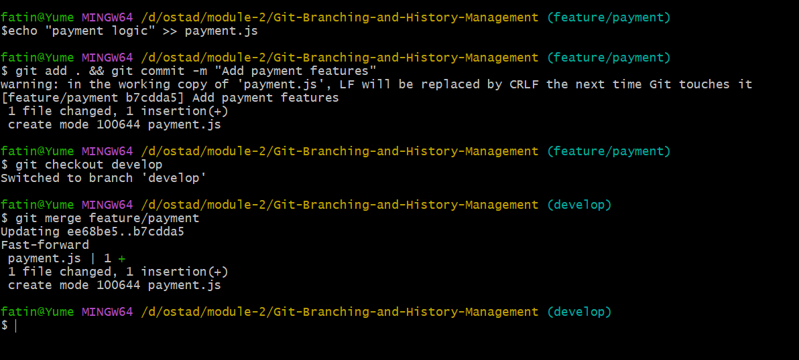
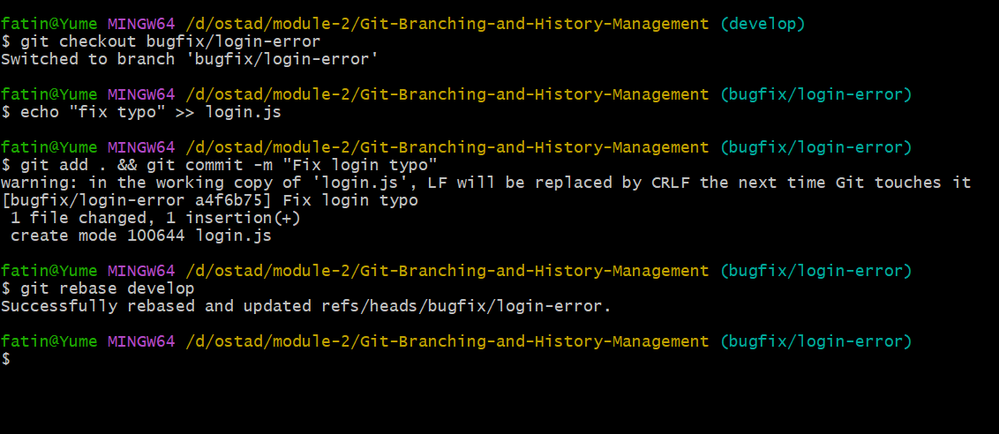
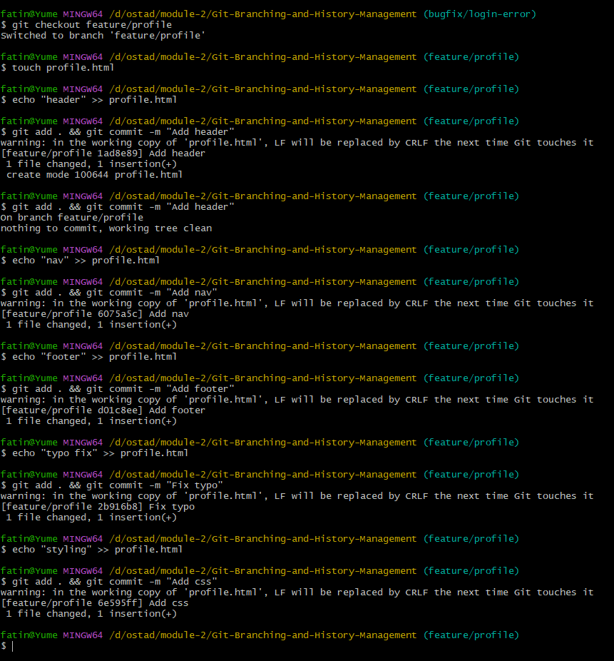
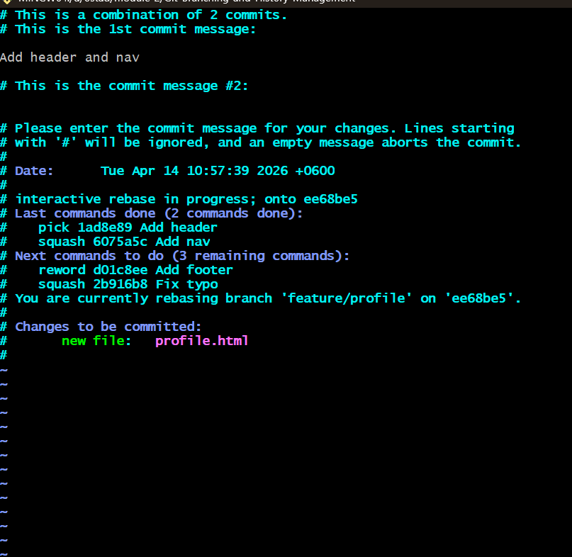
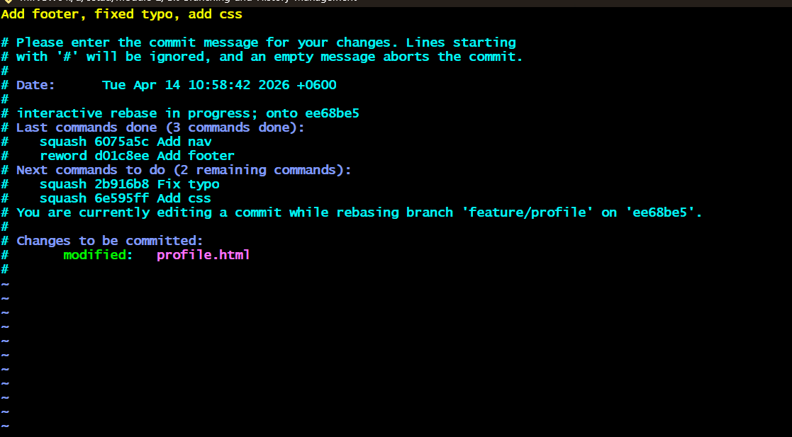
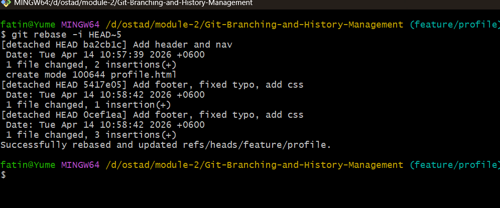
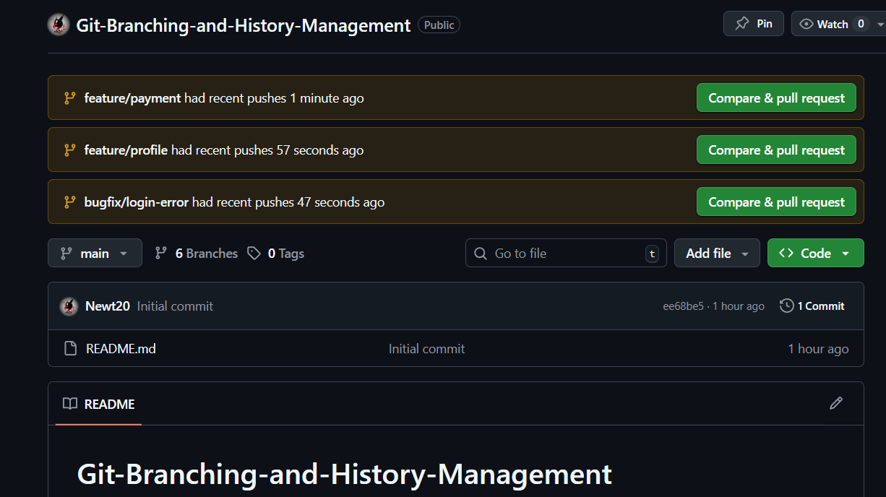

# Git-Branching-and-History-Management
Enterprise Level Git workflow, git branching, history management, pr. We also have answered some important questions, as such: What is Merge &amp; Rebase, Squash &amp; Reword? 

## 📸 Screenshots

### 1. Git Initialization
Create a git repo and clone the project. Then initialize the project by creating branches.

### 2. Create New Branches

### 3. Branch Merge

### 4. Branch Rebase

### 5. Create 5 Commits

### 6. Squash and Reword Commits

### 7. Squash and Reword Commits (Second Example)

### 8. Finalized Commit History Management

### 9. GitHub Pull Request

## 🔀 Merge Strategy

**Merge** is a non‑destructive operation that preserves the complete history of the project.  
When you merge, Git creates a new **merge commit** that ties the histories of both branches together.

---

### ✅ Pros
- **Preserves context** → Keeps the full commit history intact.  
- **Easy to understand** → Straightforward, especially for beginners.  
- **Safe** → Doesn’t rewrite history, so less risk of mistakes.  

---

### ⚠️ Cons
- **Messy history** → Can lead to many “diamond shapes” in the commit graph.  
- **Harder to trace** → Frequent merges may clutter the log.  

---

## 🔄 Rebase Strategy

**Rebase** rewrites history by moving all of your branch's commits to the tip of the target branch.  
This creates a **linear history** without merge commits.

---

### ✅ Pros
- **Clean history** → Produces a straight, linear commit graph.  
- **Easier debugging** → Simplifies tools like `git bisect`.  

---

### ⚠️ Cons
- **Risky in teams** → Rewriting public history can cause conflicts.  
- **Loses context** → The original starting point of the feature branch is hidden.  

---

## 🧹 Squash

**Squash** combines multiple commits into a single new commit.  
This is especially useful to clean up "work‑in‑progress" commits before pushing to a shared branch.

---

### ✅ Pros
- **Cleaner history** → Reduces clutter from small or experimental commits.  
- **Professional presentation** → Makes commit logs easier to read and review.  
- **Ideal for PRs** → Keeps feature branches concise when merging into main.  

---

### ⚠️ Cons
- **Loses granularity** → Individual commit details are no longer visible.  
- **Harder to trace** → Debugging specific changes may be more difficult.  

---

## ✍️ Reword

**Reword** allows you to change the commit message of a specific commit without altering the contents of the commit itself.  
This is useful for fixing typos, clarifying intent, or standardizing commit message formats.

---

### ✅ Pros
- **Fix mistakes** → Correct typos or unclear commit messages.  
- **Improve clarity** → Make commit history easier to understand.  
- **Standardize format** → Ensure messages follow a consistent style.  

---

### ⚠️ Cons
- **History rewrite** → Changing messages alters commit metadata.  
- **Potential confusion** → If used on shared/public commits, teammates may lose track of changes.  

---

